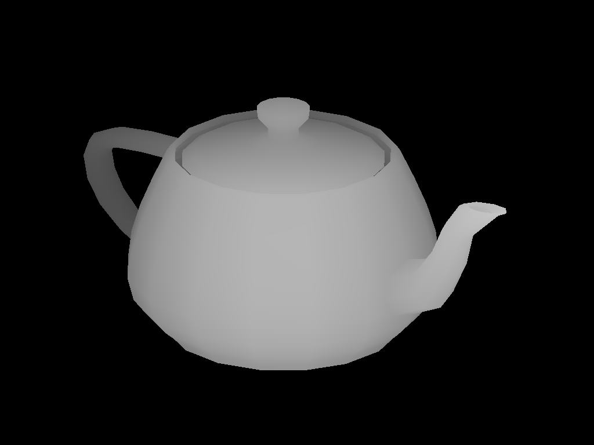

This is a random dot autostereogram [see here][https://www.youtube.com/watch?v=2AKtp3XHn38]. You can either try to see it the "legitimate" way, or by using a number of [decoding tools][https://piellardj.github.io/stereogram-solver/].

The hidden image should appear to be: 

Flag is `wctf{teapot}`