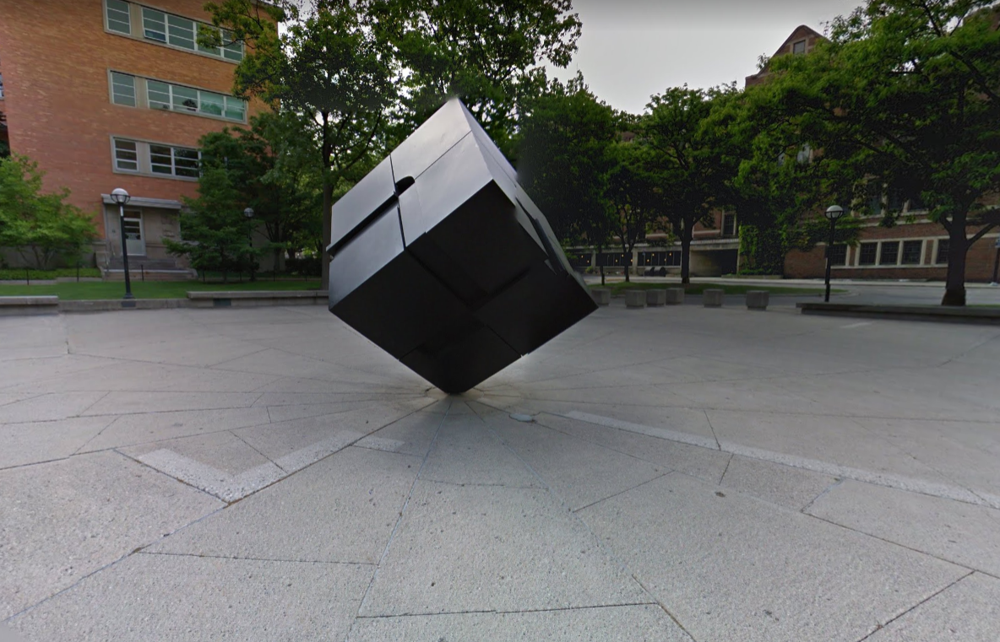

# WannaFlag I: An Introduction

**Author:** dree#0001

**Difficulty:** Easy

**Points:** 188

**Solves:** 107

## Description:

Welcome to WolvCTF's OSINT Category! We have a bunch of great OSINT lined up, assuming nothing goes wrong hahahhahahhahah but why would it?

For this challenge, find where the image was taken, and look at the Google Maps reviews!

**Note:** Flags can be found in standard format `wctf{...}` for ALL OSINT challenges

**Note:** As with the nature of OSINT, false flags can be found. If your flag does not work, it is one of these

The **OSINT Category** is as follows:

WannaFlag I: An Introduction

WannaFlag II: Payments

WannaFlag: III: Infiltration

WannaFlag IV: Exfiltration (visible after completion of WannaFlag: III: Infiltration)

WannaFlag V: The Mastermind (visible after completion of WannaFlag: III: Infiltration)